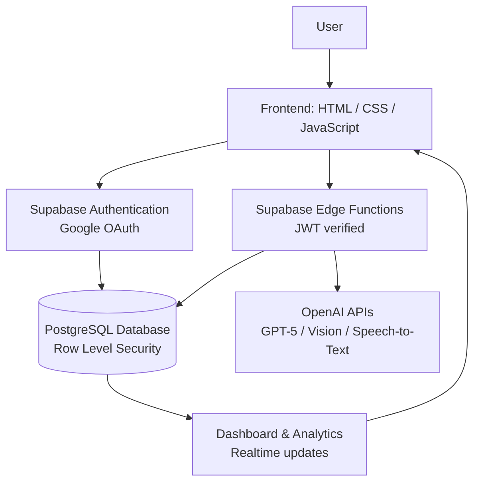

# 💸 Spendy – Spend Smarter, Save Better

[](#-license)
[](https://supabase.com)
[](https://platform.openai.com)
[](https://vercel.com)
[](#-technology-stack)

> An AI-powered personal finance platform for students and young professionals — track every expense, scan receipts, talk your spending into existence, and get budget advice that actually understands your habits.

---

## 📖 About the Project

**Spendy** is a full-stack, AI-powered expense-tracking web application built for a very specific kind of user: **students and young professionals** who are managing money on their own for the first time, usually on a tight and irregular income, and who find traditional finance tools — corporate spreadsheets, overloaded banking apps, or budgeting software built for households — too heavy, too generic, or just not built for their life.

### The problem

Most people in this group don't stop tracking expenses because they don't care about money. They stop because:

- Logging every expense by hand is tedious and easy to abandon after a few days.
- Reading a receipt and manually typing in merchant, amount, date, and category feels like busywork.
- Generic budgeting apps assume a stable monthly salary, not the irregular income of a student or early-career professional.
- Most finance dashboards show *what* was spent but never explain *what to do about it*.

### How AI improves the experience

Spendy removes the friction points that cause people to give up on tracking their spending:

- **AI receipt scanning** turns a photo of a receipt into a fully-filled expense entry in seconds.
- **AI auto-categorization** suggests the right category as soon as you type an expense title, so you rarely touch a dropdown.
- **Voice expense entry** lets you say *"I spent 250 on lunch today"* and have it parsed into a structured transaction.
- **AI spending insights** turn raw transaction history into plain-language observations about your habits.
- **AI budget recommendations** combine a deterministic budget-health calculation with GPT-5-written, human-readable advice — so the numbers are always trustworthy, and the explanation is always readable.

### Why this project is useful

Spendy is a complete, real-world reference implementation of a modern web app built **without a frontend framework or bundler** — plain HTML, CSS, and vanilla JavaScript ES modules — on top of a serverless backend (Supabase) with real authentication, Row Level Security, Realtime updates, file storage, and AI-backed serverless functions. It's useful both as a personal finance tool and as a template for building secure, AI-integrated web apps the simple way.

### Objectives

- 🎯 Make expense tracking fast enough that people actually keep doing it.
- 🎯 Use AI to remove manual data entry wherever possible, without ever letting AI touch money math (all totals and calculations are computed deterministically server-side; AI only *phrases* the explanation).
- 🎯 Keep every user's data private and isolated using database-level security (RLS), not just application-level checks.
- 🎯 Ship a fully working product using the simplest possible frontend stack — no framework, no build tooling required to run it.

---

## ✨ Key Features

### 🔐 Authentication
- Google OAuth login via Supabase Auth
- Secure, persistent session management with automatic token refresh
- Route guarding — protected pages redirect unauthenticated users to login, and authenticated users skip the login screen automatically

### 💰 Expense Management
- Add / edit / delete transactions (expenses and income)
- Receipt image upload to a private, per-user Supabase Storage bucket
- Search, type filters, and category filters (combinable)
- Sortable, paginated transactions table
- Export filtered results to **CSV** or **PDF**

### 🤖 AI Features
- **AI Receipt Scanner** — GPT-5 Vision extracts merchant, amount, date, items, tax, and category from a photographed receipt
- **AI Expense Categorization** — GPT-5 suggests a category as you type an expense title
- **AI Spending Insights** — GPT-5 turns your real transaction data into a plain-language summary and insight cards
- **AI Budget Recommendations** — a deterministic budget-health score and safe-daily-spend figure, explained by GPT-5-written recommendations
- **Voice Expense Entry** — record a spoken expense, transcribed and parsed into a structured entry automatically

### 📊 Analytics
- Interactive charts (Chart.js): Income vs Expense, Spending Over Time, Category Breakdown, Budget Progress, Savings Trend
- Selectable ranges: Daily / Weekly / Monthly / Yearly
- Monthly reports and category-level spending analysis
- Live updates via Supabase Realtime — no page refresh needed

### 👤 User Profile
- Profile management
- Light/dark theme switching (persisted, and instantly reflected across charts and the app shell)
- Account and app settings

---

## 🗂 Project Structure

```
Spendy/
│
├── assets/
│   ├── css/                   # Design tokens, base styles, and per-page stylesheets
│   ├── js/
│   │   ├── components/        # Reusable UI pieces (toasts, modals, voice entry widget)
│   │   ├── services/          # Data-access layer (Supabase client, auth, transactions, AI, etc.)
│   │   ├── pages/             # One entry script per page, wiring the DOM to services
│   │   └── utils/             # Cross-cutting helpers (route guards, formatters, theming, config)
│
├── pages/                     # Every app screen (login, dashboard, transactions, analytics, ...)
│
├── supabase/
│   ├── migrations/            # SQL schema, RLS policies, and RPC functions
│   └── functions/             # Deno Edge Functions — the server-side AI layer
│
├── scripts/
│   └── inject-env.js          # Injects public env vars into config.js at build time
│
├── .env.example                # Template for local environment variables
├── package.json
├── README.md
└── vercel.json                 # Vercel build & security header configuration
```

**Folder purposes:**

| Path | Purpose |
|---|---|
| `assets/css/` | The design system (`tokens.css`, `base.css`) plus one stylesheet per page/feature area. |
| `assets/js/components/` | Small, reusable UI building blocks used across multiple pages (toast notifications, modals, the voice-entry recorder). |
| `assets/js/services/` | The only layer allowed to talk to Supabase — one file per data domain (`authService.js`, `transactionService.js`, `aiService.js`, etc.), all built on the single client in `supabaseClient.js`. |
| `assets/js/pages/` | One entry script per HTML page; imports what it needs from `services/`, `components/`, and `utils/`, and wires it to the DOM. |
| `assets/js/utils/` | Cross-cutting helpers that don't belong to one page: route guarding, theming, formatters, sanitization, config, chart theming. |
| `pages/` | Every screen in the app besides the landing page (which lives at the project root as `index.html`). |
| `supabase/migrations/` | SQL migrations — table definitions, Row Level Security policies, storage bucket policies, and Postgres RPC functions used by the dashboard and analytics pages. |
| `supabase/functions/` | Deno-based Supabase Edge Functions — the server-side home for every AI feature, so the OpenAI key never reaches the browser. |
| `scripts/inject-env.js` | Reads `.env` and rewrites the placeholders in `config.js` with real values at build/deploy time — the only place environment variables get resolved. |

---

## 🛠 Technology Stack

| Category | Technology | Why it's used |
|---|---|---|
| **Frontend** | HTML5, CSS3, JavaScript (ES6 modules) | No framework or bundler needed to keep the app simple, fast, and dependency-light — the browser's native `import`/`export` handles modularity. |
| **Charts** | Chart.js | Lightweight, well-documented charting for the Analytics page's five visualizations, with easy light/dark theme support. |
| **Backend** | Supabase | A single platform for auth, database, storage, realtime, and serverless functions — avoids standing up and wiring together separate services. |
| **Database** | PostgreSQL | A mature, relational database with native support for Row Level Security, ideal for enforcing per-user data isolation at the database layer. |
| **Authentication** | Google OAuth + Supabase Auth | Removes the need to build or store passwords; Supabase Auth manages the OAuth flow, session tokens, and refresh logic. |
| **AI** | OpenAI GPT-5 | Powers categorization suggestions and spending/budget insight generation — used only to *phrase* results, never to perform financial math. |
| **Voice AI** | OpenAI Speech-to-Text | Transcribes spoken expense entries so users can log spending without typing. |
| **Receipt Scanner** | GPT-5 Vision | Reads receipt photos and extracts structured fields (merchant, amount, date, items, tax, category). |
| **Storage** | Supabase Storage | Stores uploaded receipt images in a private, per-user-scoped bucket. |
| **Hosting** | Vercel | Zero-config static hosting with a build step that injects environment variables before deployment. |
| **Version Control** | Git & GitHub | Source control and the standard path to deploying via Vercel's Git integration. |

---

## 🏗 System Architecture

Spendy has no backend server of its own — the browser talks directly to Supabase (and, through it, to OpenAI) using scoped, authenticated requests:

```
User
  ↓
Frontend (HTML / CSS / JavaScript)
  ↓
Supabase Authentication (Google OAuth, session/JWT)
  ↓
PostgreSQL Database (Row Level Security enforced per user)
  ↓
Supabase Edge Functions (JWT-verified, server-side only)
  ↓
OpenAI APIs (GPT-5, GPT-5 Vision, Speech-to-Text)
  ↓
Dashboard & Analytics (Realtime updates back to the browser)
```



---

## 🔄 Application Workflow

1. **User visits the landing page** (`index.html`) and clicks *Get Started*.
2. **User signs in with Google** — Supabase Auth handles the OAuth round trip; a `profiles` row is auto-created for new users via a database trigger.
3. **Dashboard loads** — stat cards, budget status, and recent transactions populate from Supabase, live via Realtime.
4. **User adds an expense** — manually, or by attaching a receipt photo.
5. **Receipt is scanned with AI** — the `scan-receipt` Edge Function calls GPT-5 Vision and fills in the transaction form.
6. **Expense is categorized automatically** — the `categorize-expense` function suggests a category as the title is typed.
7. **Analytics update** — charts re-fetch and re-render, reflecting the new data within a few hundred milliseconds.
8. **AI insights are generated** — the `generate-insights` function computes real numbers locally, then asks GPT-5 to phrase a summary and insight cards from them.
9. **Budget recommendations are displayed** — the `budget-recommendation` function combines a deterministic budget-health score with GPT-5-written guidance on the Budget page.

---

## 🧠 AI Modules

### 📷 Receipt Scanner (`scan-receipt`)
**Purpose:** eliminate manual data entry for physical receipts.
**Workflow:** the client uploads a receipt image to Supabase Storage → the Edge Function verifies the caller's JWT → sends the image to GPT-5 Vision → the model returns structured fields (merchant, amount, date, items, tax, payment method, category) → the result is written back onto the `receipts` row and used to pre-fill the transaction form. Low-confidence scans are flagged for manual review instead of being silently auto-filled.

### 🏷 Expense Categorization (`categorize-expense`)
**Purpose:** remove the friction of manually picking a category for every transaction.
**Workflow:** as the user types an expense title, a debounced call to GPT-5 returns a suggested category, shown with an "AI suggested" badge. Selecting a category manually always overrides the suggestion.

### 🎙 Voice Entry (`transcribe-voice`)
**Purpose:** let users log an expense by speaking instead of typing.
**Workflow:** the browser records audio via `MediaRecorder` → the clip is sent to the Edge Function → OpenAI Speech-to-Text transcribes it → GPT-5 extracts structured expense/income fields from the sentence (e.g. "I spent 250 on lunch today") → a pre-filled transaction modal opens for the user to confirm.

### 📈 Spending Insights (`generate-insights`)
**Purpose:** turn raw transaction history into plain-language observations, without ever letting the model do arithmetic.
**Workflow:** the function computes real totals, averages, and trends directly from the user's transactions in Postgres → those numbers (not raw transaction rows) are passed to GPT-5, which is asked only to phrase a summary and 3–6 insight cards from them → results are cached in `ai_reports` for 6 hours to limit repeated calls.

### 💡 Budget Recommendation (`budget-recommendation`)
**Purpose:** give budget advice that's both numerically trustworthy and easy to read.
**Workflow:** the function deterministically computes a budget health score and a safe daily-spend figure from the user's budget and current spending pace → GPT-5 is given only those computed numbers and asked to write 3–5 recommendation sentences — the model never calculates the numbers themselves.

---

## 🔒 Security

Spendy is designed so that a bug in the frontend can't leak another user's data, and no secret key is ever shipped to the browser:

- **Row Level Security (RLS)** — every table (`profiles`, `transactions`, `receipts`, `budgets`, `ai_reports`) has RLS policies enforced by Postgres itself, so even a compromised or buggy client can only ever read/write its own user's rows.
- **Google OAuth** — authentication is delegated entirely to Google and Supabase Auth; Spendy never stores or handles passwords.
- **JWT Authentication** — every Edge Function call includes the user's session JWT, automatically attached by `supabase.functions.invoke(...)`.
- **Protected Edge Functions** — each function verifies the caller's JWT before touching any data (`supabase/functions/_shared/authClient.ts`), and only uses a service-role ("admin") client when a write must intentionally bypass RLS (e.g. writing to `ai_reports`, which has no client-side insert policy) — and even then, the `user_id` comes from the verified JWT, never from the request body.
- **Secure environment variables** — `SUPABASE_URL` and `SUPABASE_ANON_KEY` (safe to expose — RLS enforces data access, not secrecy of this key) are injected into `config.js` at build time; `OPENAI_API_KEY` and the Supabase service-role key are set as Edge Function secrets and are never included in any file shipped to the browser.
- **No API keys exposed to the frontend** — the OpenAI key exists only inside `supabase/functions/_shared/openai.ts`, read via `Deno.env`, on the server side.

---

## ⚙️ Installation

### 1. Clone the repository
```bash
git clone https://github.com/<your-username>/spendy.git
cd spendy
```

### 2. Install dependencies
```bash
npm install
```

### 3. Create the Supabase project
1. Go to [supabase.com](https://supabase.com) → **New Project**.
2. In **SQL Editor**, run the migrations in order:
   `supabase/migrations/001_initial_schema.sql`, `002_dashboard_summary_rpc.sql`, `003_analytics_rpcs.sql`
   (or `supabase db push` if you're using the CLI).
3. In **Authentication → Providers**, enable **Google**.

### 4. Configure Google OAuth
1. In [Google Cloud Console](https://console.cloud.google.com/apis/credentials), create an OAuth 2.0 Client ID (type: Web application).
2. Add the Authorized redirect URI from Supabase (**Authentication → Providers → Google**):
   `https://<your-project-ref>.supabase.co/auth/v1/callback`
3. Paste the Client ID and Client Secret into Supabase's Google provider settings and save.

### 5. Configure environment variables
```bash
cp .env.example .env
# Fill in SUPABASE_URL and SUPABASE_ANON_KEY from
# Supabase → Project Settings → API
npm run build:config
```
This injects your real values into `assets/js/utils/config.js`. **Never** put `OPENAI_API_KEY` or the Supabase service-role key here — those are server-only secrets (next step).

### 6. Deploy the AI Edge Functions
```bash
npm install -g supabase   # one-time, or use npx supabase
supabase login
supabase link --project-ref <your-project-ref>

# Server-only secrets — never exposed to the client:
supabase secrets set OPENAI_API_KEY=sk-...
supabase secrets set OPENAI_CHAT_MODEL=gpt-5                 # optional
supabase secrets set OPENAI_TRANSCRIBE_MODEL=gpt-4o-transcribe # optional

supabase functions deploy categorize-expense
supabase functions deploy scan-receipt
supabase functions deploy transcribe-voice
supabase functions deploy generate-insights
supabase functions deploy budget-recommendation
```

### 7. Run locally
```bash
npm run dev
# open http://localhost:5500
```
Spendy uses native ES modules with no bundler, so it **must** be served over HTTP — opening `index.html` as a `file://` path will break `import` statements.

### 8. Deploy to Vercel
1. Push this repo to GitHub.
2. Import it at [vercel.com/new](https://vercel.com/new).
3. Add `SUPABASE_URL` and `SUPABASE_ANON_KEY` under **Project Settings → Environment Variables** (Production + Preview).
4. Deploy — `vercel.json` points the build command at `npm run vercel-build`, which runs `build:config` before serving.
5. Back in Supabase → **Authentication → URL Configuration**, add your Vercel domain to **Site URL** and **Redirect URLs**.

---

## 🚀 Future Improvements

- 🌍 Multi-currency support
- 👨‍👩‍👧 Shared family / group budgets
- 🔁 Recurring transactions
- 📱 Mobile application
- 📧 Email spending reports
- 🌗 Deeper dark/light theme customization
- 📴 Offline mode
- 🔮 AI-powered financial forecasting

---

## 📄 License

This project is licensed under the **MIT License**.

```
MIT License

Copyright (c) 2026 Spendy

Permission is hereby granted, free of charge, to any person obtaining a copy
of this software and associated documentation files (the "Software"), to deal
in the Software without restriction, including without limitation the rights
to use, copy, modify, merge, publish, distribute, sublicense, and/or sell
copies of the Software, and to permit persons to whom the Software is
furnished to do so, subject to the following conditions:

The above copyright notice and this permission notice shall be included in all
copies or substantial portions of the Software.

THE SOFTWARE IS PROVIDED "AS IS", WITHOUT WARRANTY OF ANY KIND, EXPRESS OR
IMPLIED, INCLUDING BUT NOT LIMITED TO THE WARRANTIES OF MERCHANTABILITY,
FITNESS FOR A PARTICULAR PURPOSE AND NONINFRINGEMENT. IN NO EVENT SHALL THE
AUTHORS OR COPYRIGHT HOLDERS BE LIABLE FOR ANY CLAIM, DAMAGES OR OTHER
LIABILITY, WHETHER IN AN ACTION OF CONTRACT, TORT OR OTHERWISE, ARISING FROM,
OUT OF OR IN CONNECTION WITH THE SOFTWARE OR THE USE OR OTHER DEALINGS IN THE
SOFTWARE.
```
